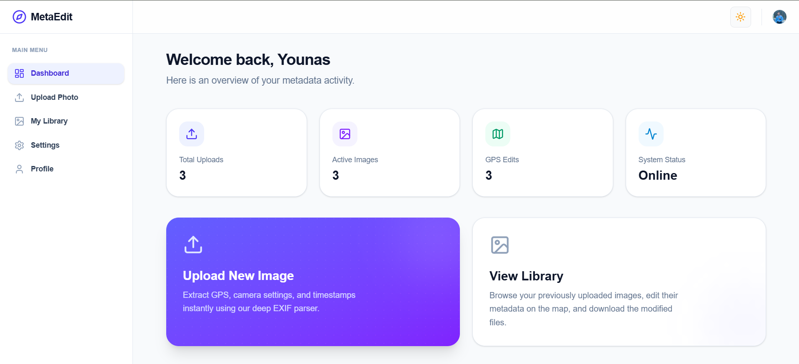
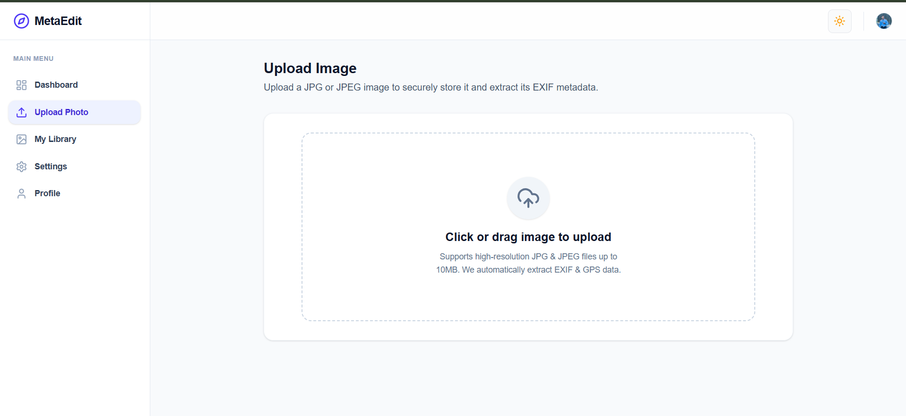
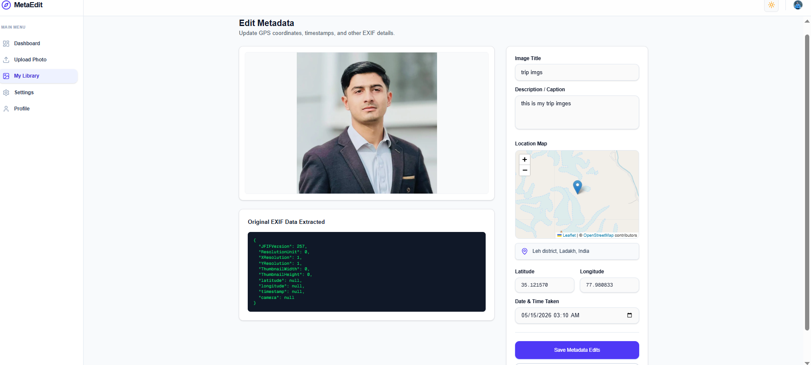

# 🚀 Image Metadata SaaS

A modern full-stack SaaS application for uploading, viewing, editing, and managing image metadata (EXIF/GPS data) with secure authentication, cloud storage, and a premium responsive dashboard.

🌐 **Live Demo:**  
https://image-metadata-saas.vercel.app

---

# ✨ Features

## 🔐 Authentication
- Secure authentication using Clerk
- Sign up / Login / Logout
- Protected dashboard routes

## 🖼️ Image Upload System
- Drag & drop image upload
- Cloudinary image storage
- Image preview before upload
- Upload progress feedback

## 📍 Metadata Management
- Extract EXIF metadata from images
- View GPS coordinates and timestamps
- Edit metadata fields
- Save updated metadata

## 📊 Dashboard Analytics
- Total uploads statistics
- Active image tracking
- Metadata edit counters
- Real-time dashboard overview

## 🌙 Modern UI/UX
- Fully responsive design
- Dark & Light mode
- Smooth animations
- Glassmorphism inspired UI
- Modern SaaS dashboard experience

## ☁️ Cloud Integration
- MongoDB Atlas database
- Cloudinary media storage
- Vercel deployment

---

# 🛠️ Tech Stack

## Frontend
- Next.js 15
- React
- TypeScript
- Tailwind CSS
- Framer Motion
- shadcn/ui

## Backend
- Next.js API Routes
- MongoDB Atlas
- Mongoose

## Authentication
- Clerk Authentication

## Cloud Services
- Cloudinary
- Vercel Deployment

---

# 📂 Project Structure

```bash


IMAGE-METADATA-SAAS/
├── .next/
├── node_modules/
├── public/
│   ├── about.txt
│   ├── Dark_Mode.png
│   ├── dashboard.png
│   ├── logo.png
│   ├── logo.svg
│   ├── metadata_Edit.png
│   └── upload_img.png
├── src/
│   ├── app/
│   ├── components/
│   ├── lib/
│   ├── models/
│   └── types/
│       ├── piexifjs.d.ts
│       └── middleware.ts
├── .env.local
├── .gitignore
├── AGENTS.md
├── CLAUDE.md
├── eslint.config.mjs
├── next-env.d.ts
├── next.config.ts
├── package-lock.json
├── package.json
├── postcss.config.mjs
├── README.md
└── tsconfig.json


---

# ⚙️ Environment Variables

Create a `.env.local` file in the root directory and add:

```env
# MongoDB
MONGODB_URI=your_mongodb_connection_string

# Clerk Authentication
NEXT_PUBLIC_CLERK_PUBLISHABLE_KEY=your_publishable_key
CLERK_SECRET_KEY=your_secret_key

# Cloudinary
CLOUDINARY_CLOUD_NAME=your_cloud_name
CLOUDINARY_API_KEY=your_api_key
CLOUDINARY_API_SECRET=your_api_secret
```

---

# 🚀 Installation & Setup

## 1️⃣ Clone Repository

```bash
git clone https://github.com/younaskhan-dev/image-metadata-saas
```

---

## 2️⃣ Navigate Into Project

```bash
cd image-metadata-saas
```

---

## 3️⃣ Install Dependencies

```bash
npm install
```

---

## 4️⃣ Setup Environment Variables

Create:

```bash
.env.local
```

Add all required environment variables.

---

## 5️⃣ Run Development Server

```bash
npm run dev
```

Visit:

```bash
http://localhost:3000
```

---

# 📸 Screenshots

## Dashboard
<!-- Dashbord img from public folder -->


## Upload Interface


## Metadata Editor


## Dark Mode


---

# 🔒 Authentication Flow

- User signs in with Clerk
- Protected dashboard routes
- Session-based authentication
- Secure API access

---

# ☁️ Deployment

## Frontend Deployment
- Vercel

## Database
- MongoDB Atlas

## Media Storage
- Cloudinary

---

# 🧠 Challenges Faced

- Handling MongoDB Atlas deployment networking
- Managing server-side metadata extraction
- Secure authentication integration
- Optimizing image upload workflows
- Production deployment debugging

---

# 🔮 Future Improvements

- AI-powered metadata suggestions
- Batch image processing
- Image compression optimization
- Advanced metadata analytics
- Folder organization system
- Team collaboration features

---

# 👨‍💻 Author

**Younas Khan**

- GitHub:https://github.com/younaskhan-dev
- LinkedIn: www.linkedin.com/in/younaskhanofficial

---

# ⭐ Final Notes

This project was developed as a full-stack SaaS prototype assessment project focusing on:
- scalable architecture
- modern UI/UX
- authentication
- cloud integration
- metadata management workflows

If you found this project useful, consider giving it a ⭐ on GitHub.